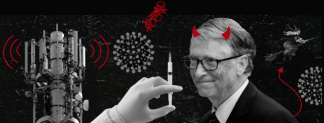

2001'den bu yana Davos ve Porto Alegre, küreselleşmenin ikiz şehirleri durumundalar: Davos yöneticiler, devlet adamları ve medyadan ünlü simaların oluşturduğu küresel bir seçkinler grubunun sıkı polis koruması eşliğinde bizi (ve kendilerini) küreselleşmenin küreselleşmeye en iyi çare olduğuna inandırmak üzere Dünya Ekonomi Forumu'nda toplandığı nadide İsviçre şehri; Porto Alegre ise küreselleşme-karşıtı hareketin karşı-seçkinler grubunun bizi (ve kendilerini) kapitalist küreselleşmenin kaçınılmaz son olmadığına -resmî sloganın da anlattığı üzere 'başka bir dünya mümkündür.'e -inandırmaya çalışmak üzere toplandıkları tropik bir Brezilya şehri. Ama nasıl olduysa Porto Alegre toplantıları o ilk baştaki ivmesini kaybetmiş gibi. Son birkaç yıldır onlardan gitgide daha az ses çıkar oldu. Porto Alegre'nin o parlak yıldızları nereye kayboldular?

En azından bir bölümü Davos'a doğru harekete geçti. Davos toplantılarının tonu şimdilerde büyük ölçüde kendilerini ironik biçimde 'liberal komünistler' diye adlandıran ve Davos ile Porto Alegre arasındaki muhalefeti artık kabul etmeyen bir girişimciler grubunca belirleniyor. Ortaya attıkları iddia da şu: Hem küreselleşip (girişimciler olarak palazlanıp) hem de (toplumsal sorumluluk, ekolojik duyarlılık gibi anti-kapitalist mücadele alanlarında kazanımlar elde etmek suretiyle) küreselleşme karşıtı olabiliriz. O halde Porto Alegre'ye ne hacet: onun yerine Davos, Porto Davos olsun bitsin.

Peki ama kim bu liberal komünistler? Olağan şüpheliler arasında: Bill Gates ve George Soros, Google'ın GEO'su, IBM, Intel, eBay'in yanısıra Thomas Friedman gibi kimi saray-filozofları var. Bugün artık, diyor bu kimseler, asıl muhafazakarlar sadece otorite, düzen ve dar bir vatanseverlik gibi gülünç inanışları olan eski sağcılar değil küreselleşmeyle savaş halinde olan eski solculardır da: iki taraf da yeni gerçeklikleri gözardı ederek gölge tiyatrosu formunda savaş verip duruyorlar. Bu liberal komünist tellalların yeni gerçekliğinin göstergesi 'akıllılık'1 olmuş durumda. Akıllı olmak da, dinamik ve göçebe olmak, merkezi bürokrasiye karşı durmak, merkezî otoriteye karşı diyalog ve işbirliğine, rutine karşı esnekliğe, sanayi üretimine karşı kültür ve bilgiye, yerleşik hiyerarşiye karşı spontan etkileşime ve 'autopoiesis'2 e inanmak demek.

Bill Gates 'sürtünmesiz kapitalizm', sanayileşme-sonrası toplum ve 'işgücünün sonu' diye adlandırdığı şeyin ikonu durumunda. Eşyanın hükümdarlığını yazılımlar devralıyor, siyah takım elbiseli eski müdürün yerine pejmurde giyinen bilgisayar kurdu gençler geçiyor. Yeni şirketin yönetiminde dış disipline çok az yer var; sahnede şimdi kolları sıvamış, saatlerce çalışan, yeşil bir çevrede bedava içkinin tadını çıkaran eski bir 'hacker' var. Burada dikkati çeken düşünce, Gates'in düzeni altüst eden marjinal bir holigan, darbe yapıp aramızda tebdili kıyafet saygın başkan şeklinde duran eski 'hacker' biri olduğu.

Liberal komünistler, yarışma ruhunu yeniden canlandıran en tepedeki yöneticiler, ya da başka biçimde söylemek gerekirse, büyük şirketlerde başa geçmiş modayı takip etmeyen, paspal karşıkültürcü tipler. Dogmaları, Adam Smith'in görünmez elinin yeni, postmodern versiyonu: Pazar ve toplumsal sorumluluk birbirinin karşıtı şeyler değildir, iki tarafın da karşılıklı çıkarı için yeniden biraraya gelinebilir. Friedman'ın dediği üzere bu koşullarda iş yapmak için kimsenin kötü olmasına gerek yok, işçilerle işbirliği, müşterilerle diyalog, çevreye saygı, iş ilişkilerinde şeffaflık başarının anahtarlarıdır. Olivier Malnuit geçtiğimiz günlerde Fransız dergisi Technikart'da liberal komünist için hazırladığı on emir yazısını yayımladı:

1. Her şeyi parasız vereceksin (serbest ulaşım, isim hakkına son); sadece ek hizmetler için para alacaksın ki bu miktar zaten seni zengin edecek.

2. Sadece bir şeyler satmayacak dünyayı değiştireceksin.

3. Toplumsal sorumluluğunun farkında olup paylaşımcı olacaksın.

4. Tasarıma, yeni teknolojilere ve bilime odaklanıp yaratıcı olacaksın.

5. Her şeyi söyleyeceksin: şeffaflık kültünü ve serbest bilgi akışını güçlendirip bunları yaşam pratiğin haline getirecek, hiçbir şeyi sır olarak tutmayacaksın; bütün insanlık işbirliği ve etkileşim içinde olmalıdır.

6. Çalışmayacaksın; 9:00-5:00 çalışma saatleri yerini kendini akıllı, dinamik, esnek iletişim içinde olacağın bir düzene bırakacak.

7. Sürekli eğitim göreceğin okula geri döneceksin.

8. Bir enzim gibi işlev görecek sadece piyasa için çalışmayıp yeni toplumsal işbirliği biçimlerini tetikleyeceksin.

9. Harcayabileceğinden daha fazlasına sahip olduğun için servetini ihtiyacı olanlara döndürecek ve fakir öleceksin.

10. Devlet sen olacaksın: şirketler devletle ortaklık içinde olmalılar.

Liberal komünistler pragmatiktir; dokriner yaklaşımlardan nefret ederler: Bugün ezilen bir işçi sınıfı yoktur, sadece Afrika'daki açlık, Müslüman kadınların çilesi, köktendincilerin uyguladığı şiddet gibi çözüm bekleyen bazı sorunlar vardır. Afrika'da bütün insanlığı ilgilendiren bir kriz yaşandığında (liberal komünistler bütün insanlığı ilgilendiren krizlerden çok hoşlanırlar, bu onların içindeki en iyiyi ortaya çıkaran şeydir) anti-emperyalist söyleme dalmaktansa biraraya gelip bu sorunu çözmenin en iyi yolunu bulmaya çalışmalı, insanları, hükümetleri ve iş dünyasını ortak bir girişimde biraraya getirmeli, merkezileşmiş devletin yardımını beklemektense bir şeyleri harekete geçirmeli ve krize yaratıcı ve yeni yollarla yaklaşılmalıdır.

Liberal komünistler kimi büyük uluslararası şirketlerin bünyelerinde ırkçılık kurallarını gözardı etme kararlarının, Güney Afrika'daki ırkçılık karşıtı doğrudan siyasi mücadele kadar önemli olduğunu belirtmekten hoşlanırlar. Onlara göre, mesela, şirket içinde ayrımcılığın kaldırılması, siyahlara ve beyazlara eşit işe eşit ücret ilkesiyle ödeme yapılması gibi uygulamalar siyasi özgürlük mücadelesi ve şirket çıkarları arasındaki buluşmanın harika bir örneğidir; çünkü aynı şirketler bugün ırkçılık sonrası Güney Afrika'da boy gösteriyor artık.

Liberal komünistler ‘68 Baharını severler. Ne güzel bir enerji patlamasıdır o ve nasıl da yaratıcıdır gençler! Bürokratik düzeni nasıl da altüst etmişlerdir! Siyasi hayallerin suya düşmesinden sonra ekonomik ve toplumsal yaşama ne büyük bir ivme kazandırmıştır bu olaylar! Yeterince yaşlı olanların kendileri de zaten sokaklarda protestolara katılmış ve savaşmışlardır: şimdi sadece dünyayı değiştirebilmek, yaşamlarımızı sahiden de devrime uğratmak adına değişmişlerdir. Zaten Marx dememiş miydi buharlı makinenin icadıyla kıyaslandığında bütün siyasi ayaklanmalar önemsizdir diye? Zaten Marx bugün de yine sormaz mıydı ki: İnternetle kıyaslandığında global kapitalizme karşı verilecek bütün bu mücadeleler nedir allahaşkına? diye.

Hepsi bir yana, liberal komünistler gerçek birer dünya vatandaşıdırlar - yani kaygılanan iyi insanlar. Popülist köktendinciler ve sorumsuz açgözlü kapitalist şirketlerden dolayı kaygılanırlar. Günümüz sorunlarının 'derinde yatan nedenlerini' görürler: kitleselleşmiş yoksulluk ve umutsuzluk köktenci terörü doğurur. Amaçları para kazanmak değil dünyayı değiştirmektir (yan ürün olarak da daha da fazla para kazanmaktır.) Tek başına Bill Gates komşusunu ne kadar çok sevdiğini eğitim için, açlık ve sıtmayla savaş için yüz milyonlarca dolar verip göstererek çoktan insanlık tarihinin en büyük hayırlar işleyen kişisi olmuştur. İşin canalıcı yanı şu ki bütün bunları verebilmek için önce almak (ya da liberal komünistçe söylemek gerekirse yaratmak) gerekiyor. Durumu meşrulaştırmanın bir yolu olarak, daha da ileri gidip, insanlara yardım etmek için yardım edecek imkanlara sahip olmak, deneyimlemek - ki bu bütün merkeziyetçi devletçiliği ve kollektifliği savunan politikaların kaçınılmaz sonunu görüp bunları bir bir tanımak demek- özel teşebbüsün elbette en etkili yöntem olduğunu öğrenmek gerekiyor. Devlet, işlerine karışarak ve abartılı bir vergilendirme uygulayarak, kendi etkinliğinin resmî amacını (çoğunluk için yaşamı daha iyi kılmak ve ihtiyacı olanlara yardım etmek) gözardı etmektedir ne yazık ki.

Liberal komünistler sadece birer kâr-makinesi olmak istemezler: hayatlarının daha da derin birer anlamı olmasını isterler. Eski moda bir şey olan din ve ruhanilik gibi şeylere, günah çıkarmayı içermeyen meditasyona (herkes bilir ki Budizm beyin biliminin öncülüdür ve meditasyonun etkilerini bilimsel yollarla ölçmek mümkündür) karşıdırlar. Toplumsal sorumluluk ve minnet ana ilkeleridir: toplumun yeteneklerini doğru yerde kullanıp zenginlik yaratmalarına izin vererek onlar için inanılmaz ölçüde iyi bir işlevi olduğunu temin etmede birinci sıradadırlar, topluma karşılığında birşey verip insanlara yardım etmenin o halde bir vazife olduğunu düşünürler.

Bu yepyeni bir olgu değildir. Çelik işçileri birlik olup ayaklandığında özel bir ordu tutup onları bastıran sonra da çelik patronu olsa da aslında altından bir kalbi olduğunu kanıtlayacak biçimde servetinin büyük bölümünü eğitim, kültür gibi topluma yararlı işler için harcayan Andrew Carnegie'yi hatırlayalım. Günümüz liberal komünistleri de aynı şekilde, bir elleriyle kaptıklarını öbür elleriyle dağıtıyorlar.

Amerika'da şu anda dükkan raflarında alıcıların hizmetine sunulmuş çikolata tadında bir müsil ilacı mevcut. Halka tanıtımı da şu paradoksla yapılıyor: Kabızlık mı çekiyorsunuz? Bu çikolatadan biraz daha yiyin! - yani kabızlığa neden olan bu şeyden daha da yiyin. Çikolata tadında müsilin yapısına günümüz ideolojik ortamı açısından bakılabilir; işte Soros gibi birini neden bu kadar muhalif görmemiz gerektiğinin nedeni tam da burada yatıyor. Karşı ajanı olan, dizginlenemez pazar ekonomisinin felakete varan toplumsal sonuçlarına duyulan insani kaygıyla birleşmiş utanmaz bir ekonomik sömürü timsali. Soros'un günlük hayatı zaten ete kemiğe bürünmüş bir yalanı yaşatmakla eşanlamlı: çalışma saatlerinin yarısı finansal spekülasyonlara diğer yarısı da kendi spekülasyonlarının etkilerine karşı-etki üretecek 'insanlığı ilgilendiren' etkinliklere (komünizm sonrası ülkelerde kültürel ve demokratik etkinlikleri finanse etmek, yazılar ve kitaplar yazmak gibi) adanmış. Bill Gates'in iki yüzü de aynı Soros'un iki yüzü gibi: bir yanda rakipleri yok eden ya da satın alan, sanal bir tekelleşmeyi hedefleyen zalim bir işadamı bir yandaysa 'İnsanlar yiyecek ekmek bulamazken bilgisayarların olması neye hizmet eder ki?' diye soran bir insansever.

Liberal komünist etiğe göre amansız bir kâr avcılığı hayırseverlikle dengelenmekte: hayırseverlik oyunun bir parçası, altta yatan ekonomik sömürüyü saklamaya yarayan insani bir maske. Gelişmiş ülkeler durmadan gelişmemiş ülkelere 'yardım' ediyorlar (yardım paketleri yollayarak, krediler vererek) ve böylelikle asıl konuyu tartışmaktan yani Üçüncü Dünya'nın bugün içinde olduğu sefaletteki paylarından ve sorumluluklarından kaçınıyorlar. 'Akıllı' ve 'akıllı olmayan' arasındaki karşıtlığa gelince, artan kaynaklar anahtar bir kavram oluyor. Üretimin, disipline edilmiş hiyerarşik iş gücü ve ekolojik kirlilik gibi karanlık tarafını (gerekli olanı) 'akıllı olmayan' Üçüncü Dünya bölgelerine (ya da 1. Dünya'da görünmez olan yerlere) ihraç ediyorsun. Liberal komünistin nihai düşü de bütün işçi sınıfını görünmez Üçüncü Dünya'nın alınteri dükkanlarına ihraç etmek.

İllüzyonlarımızdan kurtulmalıyız: liberal komünistler bütün gerçek ilerici mücadele hareketlerinin düşmanıdır. Bütün öteki düşmanlar -köktendinciler, teröristler, yolsuzluk yapan ve yetersiz devlet bürokratları- yerel koşullara bağlıdır. Tam da küresel sistemin bütün bu ikincil hatalarını çözmek istediklerinden, liberal komünistler sistemde ne bozuksa doğrudan onun temsilcisi durumundadır. Irkçılık, cinsiyetçilik ve dinsel muğlaklaştırma pratiğiyle savaşmak için, taktik olarak liberal komünistlerle ittifak kurmak yararlı olabilir, ama onların tam olarak neyi hedeflediklerini her zaman hatırlamak önemlidir.

Etienne Balibar La Crainte des masses (1997) kitabında günümüz kapitalizminde iki karşıt ama birbirini tamamlayan şiddet biçiminden söz eder ve bunları şöyle ayırır: Küresel kapitalizmin toplumsal koşullarına içkin (evsizden işsize, dışlanmış ve birbirinin yerine kolayca geçebilecek türde bireyler yaratma gibi) nesnel (yapısal) şiddet ve yeni ortaya çıkan etnik ve/veya dinsel (kısacası ırkçı) köktenciliğin uyguladığı öznel şiddet. Eğitime destek vermek için milyonlar döken Soros, yaptığı finansal spekülasyonları yüzünden binlerce hayatı mahveden ve böylelikle de lanetlediği hoşgörüsüzlüğün boy verip yükseldiği koşulları yaratan Soros'la aynı kişidir.

1 Çeviri metin boyunca 'akıllı' özgün metindeki 'smart', 'akıllı olmayan' da 'non-smart' sözcükleri için kullanılmıştır. (ç.n.)

2 Şirketler ya da iş süreçleri için kullanıldığında 'auto-poiesis', özerk ya da kendi kendini üreten anlamına gelmektedir.

Yazar: Slavoj Žižek

Çeviri: [Mine Özyurt Kılıç](https://birikimdergisi.com/guncel/937/kimsenin-kotu-olmasina-gerek-yok)

Orjinal Metin: [London Review of Books, 6 Nisan 2006](https://www.lrb.co.uk/the-paper/v28/n07/slavoj-zizek/nobody-has-to-be-vile)
