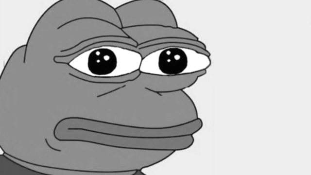
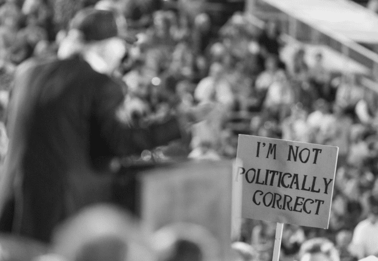

İyi sorular daima zamanın çıkmazlarına, düğümlerine yönelik olmuştur. Büyük İskender gibi bir kılıç darbesiyle Gordion düğümünü çözemesek de düğümün tasvirini ifade edebilmek son derece önemlidir. Örneğin Adorno ile Horkheimer’ın, _Nasıl oldu da aydınlanma mite, barbarlığa dönüştü?”_ ya da Agamben’in _“Nasıl oldu da demokratik rejimler totaliteryenizmi üretti?”_ gibi meşhur ve meşum sorular, **karanlığın yüreğine doğrudan bakış** attıkları için geçerliliklerini yitirmemişlerdir. Angela Nagle da Kill All Normies kitabında bunu yapıyor; hareket noktasını benzer bir formülle ifade edebiliriz: 

>“Nasıl oldu da 90’lardan beri uykuda olan siberütopyacı beklenti, 2010’ların Occupy hareketleri ve Arap Baharı ve pek çok yatay örgütlenmiş lidersiz protestolar ile tekrar uyandı ama çok geçmeden sonuç Trump’a, Brexit’e, milliyetçi, anti-feminist online yeni bir sağ kültüre, hınç ve linç siyasetine, bitimsiz kültür savaşlarına, karakter suikastlarına, hiçbir şeyin tartışılamadığı ortamlara kaydı?”

Angela Nagle, doktora tezini online alt kültürlerdeki anti-feminizm üzerine yazdı. Bu kitapta benzer bir hattı takip ediyor, mevcut ağ tipi örgütlenmelerin, anonimliğin, siber iyimserliğin koşulsuz _ilerici_ sayıldığı ve yüceltildiği bir dönemde, internetin karanlık köşelerine inip online olarak kendisini yankı odalarına kapatmış ihlalci, trol, şok edici, kışkırtıcı, politik doğruculuk karşıtı dil kullanımlarıyla etki alanını arttıran alt-kültürlerin dinamiklerini tartışıyor.

Kitabın isminde geçen “Normie” terimi, alt-right tarafından anlaşıldığı şekliyle online alt-kültürlerin gücünü kavrayamayan ve ana akım her şeyi takip eden sıradan, normal insanlara verilen addır. (Normie, ses olarak normali çağrıştırdığı için Türkçede de normi olarak kullanılabilir.) Alt-right ya da alternatif sağın kökenleri, internet öncesine dek götürülebilirse de, online bir kuvvet olarak biçim almasını blog sitelerine, 4chan gibi mem imge üreticisi goygoy yapan, ihlalci hacker taktiklerine borçludur. Alternatif sağ terimi karmaşık ve muğlaktır ama _kimlikçi bir ulusal hareket_ olarak görülebilir. Nagle, 4chan sitesini alt-right’ın piştiği merkezî yerlerden biri olarak görerek bu hareketin dinamiklerinin tehlikelerini anlatır: anonim olarak herkesin her şeyi söyleyebildiği, şok edici, pornografik, ihlalci, goygoycu online alanların yarattığı bir _karşı-kültürdür_. Üstelik geleneksel sağdan oldukça ayrıksı bir yerde konumlanır. Onların deyimiyle geleneksel muhafazakârlık _“cuckservative”_ liktir. Bu kelime cuck ile conservative/muhafazakâr kelimelerinin birleşiminden türetilmiştir ve şu mantığa dayanır: Cuck, karısını başkalarına pazarlayan, peşkeş çeken adam anlamına gelir, yani Türkçede gavat, godoş olarak karşılayabiliriz. Ayrıca cuck bir porno kategorisidir, alternatif sağın düşüncesine göre tipik muhafazakârlar, karılarını/uluslarını/ırklarını başkalarına (gene onlara göre genellikle siyahi, yabancı, öteki başkasına) becertip izleyenlerden farksızlardır, yani cuckservative/godoşmuhafazakârdırlar. Bu düşünce biçimi, online alt-kültürlerin porno üzerinden belirlenmiş duygu yapısını iyi anlatır. Özellikle de manosphere/beyosfer adını verebileceğimiz, genellikle beyaz erkeklerden oluşan, kadın düşmanı online oluşumları, 4chan içindeki intikam pornolarını ya da kadın video oyunculara yönelik tacizleri göz önünde bulundurduğunuzda godoşmuhafazakâr söyleminin bir tesadüf olmadığı görülecektir.

Nagle, tipik bir muhafazakârın, alternatif sağın kendisini gösterdiği sitelerde ya da forumlarda biraz vakit geçirse kesinlikle dehşete düşeceğini söyler. Çünkü alternatif sağ, ne sosyal olarak ne de ahlâki olarak muhafazakârdır. Hepimizin bildiği **“Türkiye’de sol sağdır, sağ da soldur”** sözlerini alternatif sağın kelimenin tam anlamıyla algıladığını ve uyguladığını söyleyebiliriz. Alternatif sağın bilinen yüzlerinden biri olan Richard Spencer: **“Sol sağdır ve alternatif sağ yeni soldur şimdi,”** diyebilmiştir.[i]

Yeni sağın trol kültürü, genellikle daha çok kadınların kullandığı Tumblr gibi sitelerde etkisini arttıran kimlik politikalarına karşı bir tepki olarak ortaya çıktı. Trollemek, bağlamsız, konuyla alakasız, kışkırtıcı yorumlarla konuyu kasten dağıtmaya, provoke etmeye çalışmak olarak tanımlanabilir. Trolün ortaya çıkışının siyasi bir kökeni olmamasına rağmen, yapısı gereği konu dışı oluşu, tabu yıkıcı nihilizmi ve sinizmi, (rebel without a cause) hiçbir şeye bağlanmadan yapılan mizahı, online kullanıcıların düşünüş biçimine de sirayet ediyor. 
Daimi olarak hiçbir şeye bağlanmadan, mesafeli, kendinin bilincinde, ironik ve sinik olmanın düzene, ana akıma karşı bir duruş olduğu ve normi olmaktan kurtardığı düşüncesi “ilericilik” olarak kabul ediliyor. Var olan düzenden rahatsızlığın ifade biçimi olarak düzen karşıtı görünen her şeyin koşulsuz yüceltilmesi, sadece online sağın değil, solun da yöntemi olmuş durumda ve bu durum yeni sağa hareket alanı sağladı. Nagle, bir söyleşisinde[ii] online sağın ihlal politikalarının ve ironinin 1968’den beri solun kullandığı şekliyle mevcut olduğunu, beklenmedik olanın ise alternatif sağın bu taktikleri devralıp, ironi ile gerçek arasındaki belirsizlikten kuvvet alarak hem ana akım muhafazakârları hem de liberal solu şaşırtması olduğunu söylüyor. Bugün post-truth rejimi dediğimiz sürece giden yoldur bu. Geleneksel sağın yumuşak ve kibar tarzı yerine şok edici, ihlalci ve sinik ironi, alternatif sağın esas düşüncelerini gizliyordu. 1970’lerin punk grupları, gamalı haç stickerlarını ironik bir şekilde kullanıp ilerici kanatta yer almaya devam ederlerken; alternatif sağ, aynı taktikleri, gamalı haç imgelerini faşizm ile olan flörtlerini gizlemek için kullandı. **Neyin ciddi, neyin ciddiyetsiz olduğunu anlayamadığınız bir trol üslubu, bu yeni sağ için oldukça elverişliydi.**

Nagle, kitabı boyunca alternatif sağın belli başlı figürlerinin ayrımlarını ve yürüttükleri kültür savaşını ele alırken, alternatif sağın düşünsel kaynaklarının ne kadar çeşitli ve çelişkili olduğunu da gösteriyor. Spengler’ın Batı Uygarlığının Çöküşü’nden Gramsci’nin “kültürel hegemonya” ve Chomsky’nin “rızanın imalatı” gibi kavramlarına dek kendilerine temellük ettikleri kaynaklar mevcut. 4chan ya da reddit gibi sitelerde en çok atıf yapılan filmlerin Matrix ve Fight Club gibi filmler olması da dikkat çekici. Hatta Matrix’teki **“kırmızı hap”** metaforu bir uyanış, ana akımdan kopuş olarak değerlendiriliyor. reddit’te “The Red Pill” adında online bir oluşum da bulunuyor. Bu tip belirli türden bir erkeklik anlayışına sahip, kadın düşmanı, içlerinde inceller, kız tavlama taktiklerini tartışan çeşitli sayfalar ve bu tarz youtuberlar gibi pek çok grubu da içeren atmosfere manosphere (beyosfer) deniyor. “Incel” terimi **involuntary celibetes** kelimelerinin kısaltılması olarak karşımıza çıkıyor. **“Gönülsüz abaza”** topluluğu diyebiliriz. Bu incel/gönülsüz abazalara göre kadınların onlara seks borcu var, bu onların temel hakkı ve bunu alamadıkları için kadınlara, özellikle güzel kadınlara öfkeliler ve intikam almak istiyorlar. Incel/gönülsüz abazaların pek çok kanlı eylemi mevcuttur. Beyosferin içinde yer alan buna benzer grupların alternatif sağın ideolojisine yakın oldukları aşikârdır.[iii] Beyosferde hakim olan erkeklik anlayışı **Alfa ve Beta erkeklik** üzerinden kurulu, Nagle’a göre aslında gayet sosyal Darwinist bir şekilde kurguluyorlar erkekliği. Onlara göre kadınlar Alfa erkeklerini tercih ederken Beta erkeklerini görmezden gelirler (Incel/gönülsüz abazalar da kendilerini Beta erkeği görürler). Erkeklik krizlerine dair bir cevap olarak okuyabileceğimiz pek çok kavramı mevcuttur. Örneğin White Knight/şövalye erkekliği ya da meriç[iv] olarak da kullanabileceğimiz terim (reddit’te Whiteknighting adlı bir oluşum bulunuyor) internette kadınları koşulsuz savunan erkeklere deniyor. İnternette hakarete, tacize maruz kalan kadınları savunmaya girişen online şövalye erkekleri onlara göre zaten kadınlarla birlikte olamayacak kadar zavallıdırlar, o yüzden umutsuzca savunurlar. Beyosferin tasavvurunda başka bir zavallı erkek modeli, **soy boy**/soya erkeğidir. Terimin kökeni soyanın östrojen hormonunu arttırdığı düşüncesi üzerine kuruludur.[v] Aşırı sağ tarafından erkek gibi olmayan, feminist, yumuşak, zayıf, kırılgan erkeklere bir hakaret olarak kullanılan soya erkeği ifadesi cuck/godoş ile de yakından bağlantılıdır.

**Bir tarafta Tumblr solu diyebileceğimiz sol, temel mücadelelerinden geri çekilmiş ve kimlik siyasetine, politik doğruculuğa, internet yargılamalarına, ahlâkçı püritenizme, linçciliğe, yanlış bir kelimeyi, yanlış addedilen bir ifade failini iptal eden, en son ve nihai olanın doğru olduğunu (çünkü artık 2019’dayız!) yalnızca ilericilik adına savunan update kültürüne karşılık diğer tarafta, ihlalci, goygoycu, ironik, sinik, anti-feminist, yabancı karşıtı, beyaz üstünlüğünü savunan, neo-Nazilere, aşırı sağa göz kırpmaktan fazlasını yapan ve fizikî bir güce dönüşmüş bir alternatif sağ vardır. Birbirlerinin aşırı uçlarıdırlar aslında. Bu haliyle birbirlerini beslerler.** Son zamanlarda Tumblr solunun anti-feminizminin gözler önüne serilmesi bu açıdan şaşırtıcı değil. Memlerin bağlamsız ve rasgele gelişen öfke dalgası gibi, her biri bir ötekine bitimsizce cevap verirler.

Angela Nagle, her gün online olarak belirli bir gruba ait olma ve birlikte hareket etmenin verdiği hissi perçinleyen kolektif nefret ayinlerini 1984 romanındaki nefret ayinlerine benzetir. Sosyal medyada saf ahlâkçı bir konum üstlenerek, başkasını parmakla göstererek kendini paranteze alan, **en kısa yoldan birilerini birkaç anahtar kelimeyle hedef almanın rahatlığı** ve ürettiği değerden bahseden Nagle, **Twitter’ın akçesi erdemdir**, der. Bu açıdan online solun ifşa ve linç kültürüne karşı duran Mark Fisher’ı anması önemlidir. Fisher, her şeyi kişiselleştirip bireyselleştiren, düşünce ve eylemi oldukça zorlaştıran, üretebildiği kadar suçluluk duygusu üreten ve düşmanını homojenleştirip ona kötü bir öz atayan sola (Naglecı kullanım ile Tumblr soluna) **“Vampirler Şatosu”** adını vermiştir. Sınıf meselesini buharlaştırıp her yeri ahlâkçılığın, erdemin doldurduğu bir ortamda söz söylemeyi imkânsız hale getiren Twitter yargılamalarının doğasını çok iyi özetler:

>“Çok ilginç, sihirli bir ters çevirip yansıtma-inkâr mekanizmasının işleyişte olduğunu fark ettim; sınıf lafını ağzınıza aldığınız anda otomatik olarak sanki ırk ya da toplumsal cinsiyetin önemini azımsıyormuşsunuz gibi davranılıyor. Oysa, bunun tam aksi doğru: Vampirler Şatosu, sınıf meselesini bulandırmak için nihai olarak liberal bir ırk ve toplumsal cinsiyet anlayışına başvuruyor. Bu yılın başında imtiyaz meselesi hakkında dönen absürd ve travmatik tweet fırtınasında sınıfsal ayrıcalıkların hiç lafının edilmemesi oldukça dikkat çekiciydi. Her zaman olduğu gibi şimdi de esas mesele, sınıf, toplumsal cinsiyet ve ırk kategorilerini birbirine eklemlemek – oysa, Vampirler Şatosu’nun ilk hamlesi sınıfı diğer kategorilerden ayırmak oldu.”[vi]

Mark Fisher bunları alternatif sağın yükselişinden önce yazmıştı. **Gelecek yokluğu, radikal bir değişim arzusunun yitişi, sol için yeni tahayyül tarzları bulmanın zorunluluğu, kapitalist gerçekçiliği kırmak,** onun temel meselelerindendi. Oysa bugüne dair korkutucu ve asla istenmeyecek türden de olsa farklı bir gelecek tarzı üreten bir **yeni sağ** bulunuyor, Tumblr solunun sıkışıp kaldığı kimlikçilik, politik doğruculuğun yarattığı boşluğu dolduruyor. Solun yenilgisi bu yeni sağa cevap veremeyerek kültür savaşlarında sıkışıp kalmasıdır.

Bizim için birbirini üreten bu aşırı uçların dışında düşünmek ve eylemek, **Vampirler Şatosu’ndan çıkmanın bir yolu olabilir**.

Koray Kirmizisakal
[Kaynak](https://birikimdergisi.com/guncel/9846/online-kultur-savaslari-ve-alt-rightin-yukselisi)

