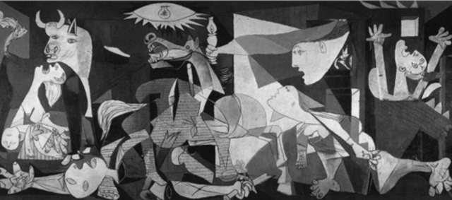

**“Even if what you feel is pain, only let yourself feel.”** _- P. D. James_

Soruları artık başkalarına değil kendimize  yönelttiğimiz günlerden geçmeye başlıyoruz.  İç Sesimiz bize bir yerlerde bir şeylerin yanlış gittiğini haykırıyor ve biz bu sessizlikte onu ancak duymaya başlayabiliyoruz. her kültürde de yaşandığı gibi kriptoda da sonrası bir evreye giriliyor.

Post-modernitenin yeni birşey üretmede yaşadığı kısırlığın aynısına ve aynı ruh haline doğru onun tadında zevksizce sürüklenmek yola çıkarken yarattığımız ideolojinin kutsiyetini zayıflatıyor. Daha zaten her şey çok yeni olmasına rağmen yine de var olanı tüketip yeni heyecan arayışlarına sürükleniyoruz. Bu kadar kısa sürede bu kadar çok üretkenlikten sonra artık yeni bir hikaye yazmakta zorlandığımız kesin. Küresel konjöktör’ün durumu ortadayken bir sonraki hype’ı yaratacak itici kuvvetin ne olması gerektiği konusunda herkeste bir soru işareti var. 

