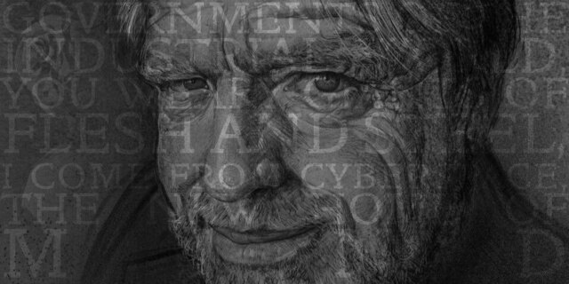
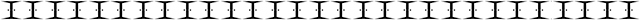

6 Şubat 2018 tarihinde yitirdiğimiz [John Perry Barlow](https://www.eff.org/tr/deeplinks/2018/02/john-perry-barlow-internet-pioneer-1947-2018)`un anısına saygıyla...

Endüstriyel dünyanın hükümetleri, siz etten ve çelikten yapılmış yorgun devler! Ben Siber Alem’den, zihnin yeni evinden geliyorum. Geleceğin temsilcisi olarak, geçmişte kalan sizlerden bizi rahat bırakmanızı istiyorum. Aramıza hoş gelmediniz. Bir araya geldiğimiz bu alemde artık sizin hiçbir egemenliğiniz yok.”

Hiç bir hükümet seçmedik, ne de seçmemiz muhtemel. Bu yüzden özgür irademiz konuşmamıza izin verdiği gibi size, sizden büyük olmayan bir yetki ile hitap ediyor. İnşa ettiğimiz Küresel Sosyal Alemi, bize zorla kabul ettirmeye çalıştığınız baskı rejimlerinden bağımsız ilan ediyorum. **Bizi yönetmek için hiç bir ahlaki değer ve hakka sahip değilsiniz, bizi korkutabilecek tüm silahlarınız da etkisizdir.**

**Hükümetler, yönetilenin rızasından beslenerek türerler.** Biz sizden hiç bir talepte bulunmadık, size yetki de vermedik. Bulunduğunuz yerlere sizi davet etmedik. Dünyamız dahil, bizi hiç tanımıyorsunuz. Siberalem sizin sınırlarınız içinde bulunmuyor. Siberalem’i bir kamu inşaat projesi gibi inşa edebileceğinizi hiç düşünmeyin. Yapamazsınız. Siberalem projesi insan doğasının eylemidir ve bizim toplu işbirliğimizle büyümektedir.

Aramızdaki büyük birliğe bağlı değilsiniz, ne de zengin pazarımızın doğuşuna katkıda bulundunuz. Kültürümüzü bilmiyorsunuz, etikten habersizsiniz. **Bizim yazılmamış kodlarımızla oluşan düzen, sizin herhangi biriniz tarafından dayatılan düzenden, çok daha etkili yönetiyor dünyayı.**

Aramızda, sizin çözmek istediğiniz sorunlar olduğunu iddia ediyorsunuz. Bu iddiayı bir gerekçe olarak kullanıp bölgemizi işgal etmeye çalışıyorsunuz. Bu sorunlar da gerekçeler de yersiz. Hatalarımız, çatışmalarımız elbet vardır. Ama ne olursa olsun biz onları tanımlar ve gereken şekilde müdahale ederiz. **Kendi toplumsal sözleşmemizi oluşturuyoruz. Bu yönetim, kendi koşullarımız ile oluşacak, sizin kurallarınızla değil.** Bizim Dünya’mız farklı.

Siberalem işlemlerden, ilişkilendirmelerden ve iletişim ağı içerisinde oluşan dalgalar gibi dizilerek kendini besler. Bizimki aynı zamanda heryerde olan ve hiç bir yerde olmayan bir dünya, ama organlarımızın yaşamadığı bir yer.

Irk, ekonomik güç, askeri güç ya da doğumhanelerin neden olduğu zararlardan etkilenmeden, önyargısız ve herkesin girebileceği bir dünya yaratıyoruz.

Herkesin, her yerde, özgürce, ne olursa olsun, hiç bir zorbalığa maruz kalmadan ve korkusuzca kendi inançlarını ifade edebileceği bir dünya yaratıyoruz.

Mülkiyet, ifade, kimlik, hareket ve bağlam gibi yasal kavramlarınız bizim alemimizde geçersizdir. Bunların hepsi sorun bazındadır ve hiç birinin bu alemde önemi yoktur.

Biz kütlesiz kimlikleriz, sizden farklı olarak, bizde fiziksel baskı etkisizdir. **İnanıyoruz ki yönetmeliğimiz, etiğimizden, aydınlanmış kişisel çıkarlarımızdan ve kamu yararlarından doğacaktır.**

Kimliklerimiz, birçok yargı bölgelerine yayılmış olabilir. Var olan kültürümüzün kabul ettiği tek yasa, Altın Kural’dır. Bu temelde çözümler oluşturabileceğimize inanıyoruz. Ama dayatmaya çalıştığınız çözümleri, kabul etmeyeceğiz.

Amerika Birleşik Devletleri’nde, bugün Telekomünikasyon Reformu Yasasını çıkardınız. Bu yasa kendi anayasanıza ve Jefferson, Washington, Mill, Madison, De Toqueville, ve Brandeis’in hayallerine karşı bir hakarettir. Onların hayalleri artık bizim içimizde yeniden doğmalıdır.

**Kendi çocuklarınızdan korkuyorsunuz. Oysa onlar, ömrünüz boyunca hep göçmen kalacağınız bir dünyanın yerlileri.** Onlardan korkup, ebeveyn sorumluluklarınızdan kaçarak onları bürokrasiye emanet ediyorsunuz. Bizim dünyamızda hümanizmin duyguları ve ifadeleri, düşünceden, meleklere kadar, kusursuz bir bütünün parçası, bit’lerin (1 bit bilgisayar dilinde en küçük birimdir 0 ve 1 değerleri alabilmektedir.) küresel sohbetidir. Biz havada çırpınan kanatların estirdiği rüzgarları ayıramayız.

Çin’de, Almanya’da, Fransa’da, Rusya’da, Singapur’da, İtalya’da, ve Amerika Birleşik Devletlerin’de, Siber sınırlarına gözlemci yerleştirerek özgürlük virüsünü önlemeye çalışıyorsunuz. Bu sadece çok kısa süreliğine yayılmasını engeller, çok yakında dijital çağa varacak bir dünyada tamamen yararsız bir çabadır.

**Eski bilgilere dayanarak büyüyen dünyanız, kendisini yasalar çıkararak korumayı deneyecek, Amerika’da ve dünyanın her yerinde. Oysa bu yasalar, pik demirden bile daha az asil değersiz bir endüstriyel ürün olacaklar.**

**Bizim dünyamızda, insan zihni ne yaratırsa yaratsın, sonsuz miktarda çoğaltılabilir ve ücretsiz dağıtılır. Düşüncelerin küresel iletisini gerçekleştirmek için artık sizin fabrikalarınıza ihtiyaç kalmadı.**

Özgürlüğe karşı aldığınız, giderek düşmanca ve sömürgeci önlemler, bizi bizden önceki özgürlükçü güçlerin uzak ve tekil otoriteye verdiği mücadeledeki konuma getiriyor. **Sanal ben’lerimizin sizin egemenliğinize karşı duyarsız olduğunu bilmelisiniz, bedenlerimiz üzerinden yasalarınıza uysak bile. Kendimizi evren boyunca yayarak kimsenin düşüncelerimizi durdurmasına izin vermeyeceğiz.**

**Siberalem’de akılsal bir uygarlık yaratacağız. Ve uygarlığımız, sizin bizden önce yarattığınız dünyayı yöneten hükümetlerden çok daha hümanist olacak.**

[Original Manifesto](https://www.eff.org/tr/cyberspace-independence)

Çeviri:
[www.dunyalilar.org](https://dunyalilar.org/a-declaration-of-the-independence-of-cyberspace.html)